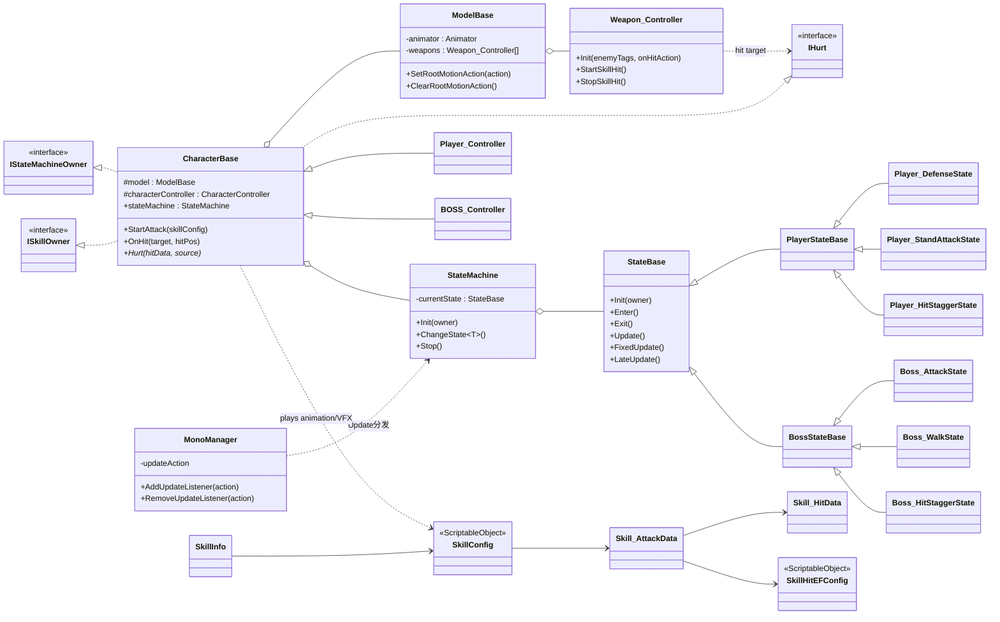

# RPG-demo (Action Combat Prototype)

Unity 2022.3.53f1c1 的第三人称动作战斗 Demo，核心聚焦在「状态机 + 动画事件驱动战斗 + 数据驱动技能 + Boss 行为决策」。

## 演示视频要点 (建议录 60-120s)

1. 玩家基础移动：WASD 相机相对移动、Walk/Run/Sprint 切换、跳跃/翻滚
2. 战斗手感：普攻连段、技能释放、多段命中、命中特效/音效、冻结帧(Freeze Frame)/短时停(TimeScale)
3. 防御与反击：举盾 Hold、弹反/反击窗口、破防技能命中
4. Boss 行为：NavMesh 追击、对峙/警戒、距离判断进入攻击、技能/普攻决策
5. 受击链路：方向受击、硬直(HitStop)、击飞 -> 空中 -> 倒地 -> 起身

## 运行方式

1. 用 Unity Hub 打开工程（Editor：`2022.3.53f1c1`）。
2. 打开场景：`Assets/Scenes/SampleScene.unity`。
3. Play 运行。

## 操作说明 (键鼠)

- 移动：`W/A/S/D`
- 视角：鼠标移动
- 跳跃：`Space`（InputSystem：`PlayerInput.inputactions` -> Jump）
- 翻滚：`F`（InputSystem：Roll）
- 冲刺：`Left Shift`（InputSystem：Sprint）
- 切换走路：`CapsLock`（InputSystem：ToggleWalk）
- 瞄准：鼠标右键（InputSystem：Aim）
- 蹲下：`Ctrl`（InputSystem：Crouch）
- 锁定：鼠标中键（InputSystem：LockOn）
- 普攻：`G`（代码内直读 Input）
- 防御：`B`（代码内直读 Input）
- 子弹时间(调试)：`T`
- 暂停(调试)：`K`
- 技能：由 `SkillInfo.keyCode` 在 Inspector 配置（常见为 `1/2/3...`）

## 架构图 (Mermaid)

```mermaid
flowchart LR
  subgraph Input[Input Layer]
    IA[PlayerInput.inputactions] --> PIR[PlayerInputReader]
  end

  subgraph Player[Player]
    PIR --> PMH[PlayerMovementHelper]
    PC[Player_Controller] --> SM[StateMachine]
    PMH --> PC
    SM --> PS[Player States]
  end

  subgraph Boss[Boss]
    BC[BOSS_Controller] --> BSM[StateMachine]
    BSM --> BS[Boss States]
    BS --> NMA[NavMeshAgent追击/对峙]
  end

  subgraph Combat[Combat Pipeline]
    PC --> CB[CharacterBase: StartAttack/OnHit]
    BC --> CB
    CB --> MB[ModelBase(Animator)]
    MB -->|OnAnimatorMove| RM[RootMotionAction回调]
    RM --> CC[CharacterController.Move]

    MB -->|AnimationEvent\nStartSkillHit/StopSkillHit| WC[Weapon_Controller]
    WC -->|OnTriggerStay| HIT[OnHit/OnHitForReleaseData]
    HIT -->|IHurt.Hurt| HURT[Player/Boss Hurt]
    HURT -->|ChangeState| SM
    HURT -->|ChangeState| BSM
  end
```

## 模块亮点 (对应脚本)

- 自研轻量状态机（纯 C# 状态类，统一 Update 分发）：`Assets/Scripts/Frame/StateMachine/StateMachine.cs`、`Assets/Scripts/Frame/Mono/MonoManager.cs`
- 通用角色基类：HP、技能链路、冻结帧/时停、命中/受击接口：`Assets/Scripts/Frame/Character/CharacterBase.cs`
- 动画事件驱动战斗：`ModelBase` 统一处理 RootMotion + AnimationEvent：`Assets/Scripts/Skill/ModelBase.cs`
- 武器命中判定：触发器命中去重、忽略武器互撞：`Assets/Scripts/Skill/Weapon_Controller.cs`
- 数据驱动技能：`SkillConfig` / `SkillHitEFConfig`（ScriptableObject）：`Assets/Scripts/Skill/SkillConfig.cs`、`Assets/Scripts/Skill/SkillHitEFConfig.cs`
- Boss AI：距离/技能 CD/破防优先级决策 + NavMesh 追击/对峙：`Assets/Scripts/Enemy/Boss/State/Boss_AttackState.cs`、`Assets/Scripts/Enemy/Boss/State/Boss_WalkState.cs`
- 受击手感：方向受击 + HitStop + 击飞胶囊体压缩恢复：`Assets/Scripts/Enemy/Boss/State/Hurt/Boss_HitStaggerState.cs`、`Assets/Scripts/Enemy/Boss/State/Hurt/Boss_HurtStateBase.cs`
- 命中反馈：震屏(Cinemachine Impulse) + 色差(PostProcessing)：`Assets/Scripts/Player/PostProcessManager.cs`

## UML 类图 (Mermaid)



## 目录结构 (脚本)

- `Assets/Scripts/Frame/`：状态机、Update 分发、Singleton、角色基类
- `Assets/Scripts/Input/`：InputSystem 绑定与读取
- `Assets/Scripts/Player/`：玩家控制器、黑板、移动辅助、玩家状态机
- `Assets/Scripts/Enemy/`：敌人/黑板/移动辅助、Boss 控制器与 Boss 状态机
- `Assets/Scripts/Skill/`：技能数据、命中数据、武器与动画事件桥接

## 依赖包 (manifest)

- Input System、Cinemachine、AI Navigation、PostProcessing 等（见 `Packages/manifest.json`）

